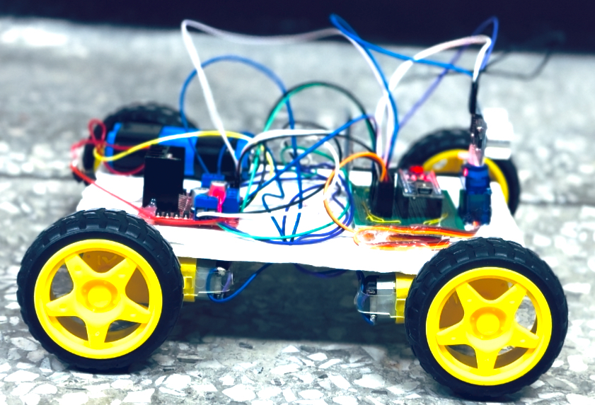
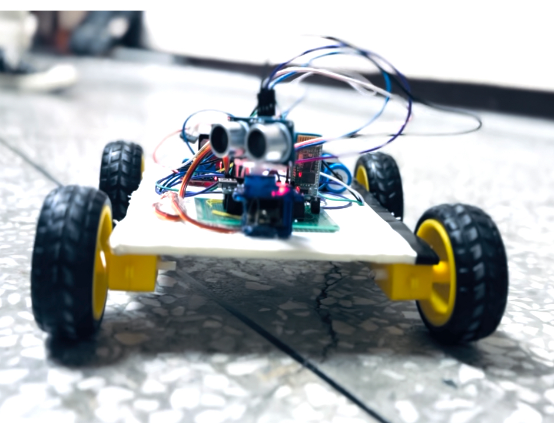
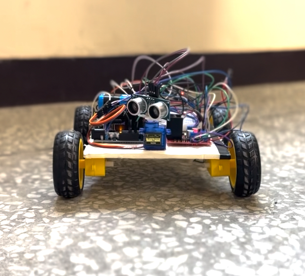

# obstacle-avoiding-car-arduino



Arduino-powered robot car that uses an ultrasonic sensor to detect and avoid obstacles.
## Features
- **Ultrasonic sensor** to detect obstacles ahead.
- **Servo motor** rotates the sensor to check left/right.
- **DC motors** driven by L298N H-bridge to move and steer the car.
- Real-time obstacle avoidance using distance measurement.

## Hardware Components
- Arduino Uno
- HC-SR04 Ultrasonic Sensor
- Servo Motor
- L298N Motor Driver
- 2 DC Motors + Wheels
- Chassis
- 9V Battery or Power Bank

## Arduino Code Snippet
```cpp
#include <Servo.h>
#include <NewPing.h>

#define trig_pin A1
#define echo_pin A2
#define maximum_distance 200

Servo servo_motor;
NewPing sonar(trig_pin, echo_pin, maximum_distance);

// for More code contact me . 
